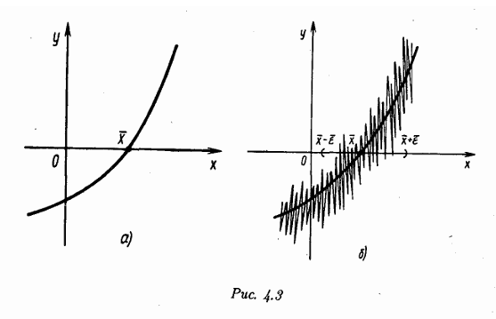

# mathmod - библиотека программ для численного моделирования

## Содержание
- [mathmod - библиотека программ для численного моделирования](#mathmod---библиотека-программ-для-численного-моделирования)
  - [Содержание](#содержание)
  - [Решение нелинейных уравнений](#решение-нелинейных-уравнений)
    - [Постановка задачи](#постановка-задачи)
    - [Основные вопросы](#основные-вопросы)
    - [1. Метод Ньютона](#1-метод-ньютона)
    - [2. Упрощённый метод Ньютона](#2-упрощённый-метод-ньютона)
    - [3. Метод секущих](#3-метод-секущих)
    - [4. Метод ложного положения](#4-метод-ложного-положения)
    - [5. Метод бисекций](#5-метод-бисекций)
    - [6. Метод простой итерации](#6-метод-простой-итерации)
  - [Решение систем линейных алгебраических уравнений (СЛАУ)](#решение-систем-линейных-алгебраических-уравнений-слау)
    - [Постановка задачи](#постановка-задачи-1)
    - [Основные вопросы](#основные-вопросы-1)
    - [Прямые методы](#прямые-методы)
      - [1. Метод Гаусса (схема единственного деления)](#1-метод-гаусса-схема-единственного-деления)
      - [2. Метод Холецкого (LLT-разложение)](#2-метод-холецкого-llt-разложение)
      - [3. Метод LU-разложения](#3-метод-lu-разложения)
    - [Итерационные методы](#итерационные-методы)
      - [1. Метод Якоби](#1-метод-якоби)
      - [2. Метод Гаусса-Зейделя](#2-метод-гаусса-зейделя)
  - [Установка](#установка)

---

## Решение нелинейных уравнений

### Постановка задачи

Задача отыскания корней нелинейного  уравнения с одним неизвестным вида:

$$
f(x) = 0
$$

**Корень уравнения** - значение $\overline{x}$, при котором $f(\overline{x}) = 0$. Геометрически, $\overline{x}$ является абсциссой точки пересечения графика $f(x)$ с осью $Ox$.

Для заданной точности $\epsilon$ требуется найти приближенное значение корня $\overline{x}^{*}$ такое, что:

$$
|\overline{x} - \overline{x}^{*}| \leq \epsilon
$$

Пусть функция $f(x)$ *дифференцируема* $m > 1$ раз в точке $\overline{x}$, тогда:

**Простой корень** - корень уравнения  $\overline{x}$ называется простым, если $f'(\overline{x}) \neq 0$.

**Кратный корень** - корень уравнения  $\overline{x}$ называется простым, если $f'(\overline{x}) = 0$. Целое  число $m$ назовем кратностью корня $\overline{x}$, если $f^{(k)}(\overline{x}) = 0$, для $k = 1, 2, ..., m - 1$ и $f^{(m)}(\overline{x}) \neq 0$.

**Этапы решения уравнения:**
1. Локализация корня;
2. Вычисление корня с заданной точностью.

**Отрезок локализации** - отрезок $[a, b]$, который содержит 1 корень уравнения.

### Основные вопросы

**Сходящийся итерационный процесс** - метод отыскания корня $\overline{x}$, заключающийся в построении последовательности приближений к нему $x^{(0)}, x^{(1)}, ..., , x^{(k)}, ...$ такой, что:

$$
\lim_{k \to \infty} x^{(k)} = \overline{x}
$$

**Порядок сходимости:**

Пусть в некоторой малой окрестности корня  $\overline{x}$ уравнения $f(x) = 0$ итерационная поледовательность удовлетворяет неравенству:

$$
|\overline{x} - x^{(k)}| \leq C|\overline{x} - x^{(k - 1)}|^{p}
$$

, где $С > 0$ и $p \geq 1$ - постоянные. Тогда $p$ называется *порядком сходимости*.

*Порядок сходимости* - скорость уменьшения погрешности между последовательными приближениями решения. 

**Одношаговый итерационный метод** - метод, у которого очередное приближение $x^{(k + 1)}$ находится только через одно предыдущее $x^{(k)}$. Для его работы нужно знать только одно начальное приближение $x^{(0)}$. (Пример - *метод Ньютона*)

**Многошаговый итерационный метод ($l$ - шаговый)** - метод, у которого очередное  приближение $x^{(k + 1)}$ находится $l$ предыдущих $x^{(k)}, x^{(k - 1)}, ...,  x^{(k - l + 1)}$. Для него следует задать $l$ начальных приближений $x^{(0)}, x^{(1)}, ..., x^{(l - 1)}$. (Пример - *метод секщих*)


**Интервал неопределенности** - окрестность $(\overline{x} - \epsilon, \overline{x} + \epsilon)$ внутри которой любую точку можно принять за приближение к корню.



### 1. Метод Ньютона
- Быстрый итерационный метод для нахождения корня уравнения  $f(x) = 0$.
- Требует предоставления функции $f(x)$ и её производной $f'(x)$.
- **Функция:** `newton(f, df, x, epsilon=1e-6)`
- **Описание параметров:**
  - `f` - Функция, корень которой нужно найти;
  - `df` - Производная функции;
  - `x` - Начальное приближение корня;
  - `epsilon` - Заданная точность (по умолчанию $10^{-6}$). 

```python
from mathmod.nonlinear_equations import newton

x, iteration = newton(f, df, x, epsilon=1e-6)
```

<b>Расчетная формула:</b>
  
$$
x^{(n+1)} = x^{(n)} - \frac{f(x^{(n)})}{f'(x^{(n)})}
$$

<b>Сходимость метода:</b> <i>квадратичная</i> (при выборе начального приближения из достаточно малой окрестности).

<b>Критерий окончания:</b>

$$
|x^{(n+1)} - x^{(n)}| < \varepsilon
$$


### 2. Упрощённый метод Ньютона
- Упрощённая версия метода Ньютона, где производная функции вычисляется только один раз.
- **Функция:** `simplified_newton(f, df, x0, epsilon=1e-6)`<br>
- **Описание параметров:**
  - `f` - Функция, корень которой нужно найти;
  - `df` - Производная функции;
  - `x` - Начальное приближение корня;
  - `epsilon` - Заданная точность (по умолчанию $10^{-6}$). 
  
```python
from mathmod.nonlinear_equations import simplified_newton

x, iteration = simplified_newton(f, df, x0, epsilon=1e-6)
```

<b>Расчетная формула:</b>
  
$$
x^{(n+1)} = x^{(n)} - \frac{f(x^{(n)})}{f'(x^{(0)})}
$$

<b>Сходимость метода:</b> скорость сходимости тем выше, чем ближе начальное приближение $x^{(0)}$ к решению $\overline{x}$.

<b>Критерий окончания:</b>

$$
|x^{(n+1)} - x^{(n)}| < \varepsilon
$$


### 3. Метод секущих
- Не требует аналитической производной функции.
- Использует приближённую производную.
- **Функция:** `secant(f, x_minus_1, x_n, epsilon=1e-6)`
- **Описание параметров:**
  - `f` -  Функция, корень которой нужно найти;
  - `x_minus_1` - Первой начальное приближение;
  - `x` - Второе начальное приближение;
  - `epsilon` - Заданная точность (по умолчанию $10^{-6}$). 

```python
from mathmod.nonlinear_equations import secant

x, iteration = secant(f, x_minus_1, x_n, epsilon=1e-6)
```

<b>Расчетная формула:</b>
  
$$
x^{(n+1)} = x^{(n)} - \frac{x^{(n-1)} - x^{(n)}}{f(x^{(n-1)}) - f(x^{(n)})} f(x^{(n)})
$$

<b>Сходимость метода:</b> $p = \frac{\sqrt{5} + 1}{2} \approx
1.618$ - <i>сверхлинейная</i>, если вычисляется простой корень. При неудачном выборе приближения, метод расходится. Поэтому требуется выбор двух близких к $\overline{x}$ начальных приближений $x^{(0)}$ и $x^{(1)}$.

<b>Критерий окончания:</b>

$$
|x^{(n+1)} - x^{(n)}| < \varepsilon
$$


### 4. Метод ложного положения

- **Функция:** `false_position(f, a, b, epsilon=1e-6)`
- **Описание параметров:**
- `f`: Функция, корень которой нужно найти;
- `a`: Левый конец начального отрезка локализации корня;
- `b`: Правый конец начального отрезка локализации корня;
- `epsilon`: Заданная точность (по умолчанию $10^{-6}$).

```python
from mathmod.nonlinear_equations import false_position

x, iteration = false_position(f, a, b, epsilon=1e-6)
```

<b>Расчетная формула:</b>
  
$$
x^{(n+1)} = x^{(n)} - \frac{c - x^{(n)}}{f(c) - f(x^{(n)})} f(x^{(n)})
$$

, где $c$ - некторая точнка из окрестности корня. 

<b>Сходимость метода:</b> <i>линейная</i>. Для достижения заданной точности требуется тем меньше итераций, чем ближе к корню лежит точка $c$.

<b>Критерий окончания:</b>

$$
|x^{(n+1)} - x^{(n)}| < \varepsilon
$$


### 5. Метод бисекций
- Работает на основе деления отрезка, учитывая значения функции.
- Требует, чтобы начальный отрезок $[a, b]$ удовлетворял условию $f(a) * f(b) < 0$.
**Функция:** `bisection(f, a, b, epsilon)`

**Описание параметров:**
- `f` - Функция, корень которой нужно найти;
- `a` - Левый конец начального отрезка локализации корня;
- `b` - Правый конец начального отрезка локализации корня;
- `epsilon` - Заданная точность (по умолчанию $10^{-6}$).

```python
from mathmod.nonlinear_equations import bisection

x, iteration = bisection(f, a, b, epsilon=1e-6)
```

**Расчетная формула:**

$$
c = \frac{a + b}{2}
$$

**Сходимость метода:** со скоростью геометрической прогрессии, знаменатель которой $q = \frac{1}{2}$.

**Критерий окончания:**

$$
{b^{(n)} - a^{(n)}} < 2\varepsilon
$$

Тогда $x^{(n)} = \frac{ a^{(n)} + b^{(n)} }{2}$ является искомым приближением к корню с точностью $\epsilon$.


### 6. Метод простой итерации
**Функция:** `simple_iteration_method(phi, x0, epsilon=1e-6)`

**Описание параметров:**
- `phi` - Итерационная функция $\phi(x)$, преобразующая исходное уравнение $f(x) = 0$ к виду $x = \phi(x)$;
- `x0` - Начальное приближение корня;
- `epsilon` - Заданная точность (по умолчанию  $10^{-6}$).

```python
from mathmod.nonlinear_equations import simple_iteration_method

x, iteration = simple_iteration_method(phi, x0, epsilon=1e-6)
```

**Расчетная формула:**

$$
x^{(n + 1)} = \phi(x^{(n)})
$$

**Теорема о сходимости:** 

Если в окрестности корня функция $\phi(x)$ непрерывно дифференцируема и удовлетворяет условию:

$$
\max_{x \in [a, b]} |\phi(x)| \leq q 
$$

где $0 \leq q < 1$ - постоянная 

Тогда независимо от выбора начального приближения $x^{(0)}$ из указанной окрестности корня итерационная последовательность не выходит из этой окрестности, метод сходится со скоростью геометрической прогресии и справедлива следующая оценка погрешности (априорная оценка):

**Априорная оценка** - показывет, что итерационный метод сходится

$$
|x^{(n)} - \overline{x}| \leq q^{n}|x^{(0)} - \overline{{x}}|
$$

Чем меньше $q$, тем выше скорость сходимости.

**Апостериорная оценка** - критерий окончания итерационного процесса 

$$
|x^{(n)} - x^{(n-1)}| \leq \frac{1 - q}{q}\epsilon
$$

Если это условие выполнено, то можно считать, что $x^{(n)}$ является приближением к $\overline{x}$ с точностью $\epsilon$.


## Решение систем линейных алгебраических уравнений (СЛАУ)

### Постановка задачи

Система уравнений в общем виде:

$$
\begin{aligned}
    a_{11}x_1 + a_{12}x_2 + a_{13}x_3 + \dots + a_{1m}x_m &= b_1, \\
    a_{21}x_1 + a_{22}x_2 + a_{23}x_3 + \dots + a_{2m}x_m &= b_2, \\
    a_{31}x_1 + a_{32}x_2 + a_{33}x_3 + \dots + a_{3m}x_m &= b_3, \\
    &\dots \\
    a_{m1}x_1 + a_{m2}x_2 + a_{m3}x_3 + \dots + a_{mm}x_m &= b_m.
\end{aligned}
$$


В матричной форме эта система принимает вид:

$$
A \mathbf{x} = \mathbf{b}
$$


, где

$$
A = 
\begin{bmatrix}
    a_{11} & a_{12} & a_{13} & \dots & a_{1m} \\
    a_{21} & a_{22} & a_{23} & \dots & a_{2m} \\
    a_{31} & a_{32} & a_{33} & \dots & a_{3m} \\
    \dots & \dots & \dots & \dots & \dots \\
    a_{m1} & a_{m2} & a_{m3} & \dots & a_{mm}
\end{bmatrix}, \quad
\mathbf{x} =
\begin{bmatrix}
    x_1 \\
    x_2 \\
    x_3 \\
    \vdots \\
    x_m
\end{bmatrix}, \quad
\mathbf{b} =
\begin{bmatrix}
    b_1 \\
    b_2 \\
    b_3 \\
    \vdots \\
    b_m
\end{bmatrix}
$$

$m$ - порядок матрицы;

$A$ - невырожденная матрица ($\Delta A \neq 0$, т.е. $\exists$ единственное решение);

$x$ - вектор неизвестных;

$b$ - вектор свободных членов; 

Пусть $\overline{{x}}$ - точное решение, $x^{\ast}$ - приближенное решение.

$$
\mathbf{\overline{{x}}} =
\begin{bmatrix}
    \overline{{x}}_1 \\
    \overline{{x}}_2 \\
    \overline{{x}}_3 \\
    \vdots \\
    \overline{{x}}_m
\end{bmatrix}  \quad
\mathbf{x^{\ast}} =
\begin{bmatrix}
    x^{\ast}_1 \\
    x^{\ast}_2 \\
    x^{\ast}_3 \\
    \vdots \\
    x^{\ast}_m
\end{bmatrix}
$$

Тогда вектор $\epsilon = \overline{{x}} - x^{*}$ называется вектором погрешности.

<b>Задача:</b> 

Найти решение системы $Ax = b$ с точностью $\epsilon$. Это означает, что нужно найти вектор $x^{\ast}$ такой, что $|| \overline{{x}} - x^{*} || \leq \epsilon$, где $|| \cdot ||$ - одна из норм (единичная, евклидова, бесконечности).


### Основные вопросы

**Прямой метод** - метод, который позволяет получить решение после выполнения конечного числа элементарных операций;

**Итерационный метод** - метод, который строит последовательность приближений к решению;

**Норма** - будем говорить, что в $R^{m}$ введена норма, если каждому вектору $x \in R^{m}$ сопоставлено вещественное число, обозначаемое $||x||$.

1. **Нормы векторов:**

   

   *Свойства норм векторов:*

   

2. **Нормы матриц:**

   

   *Свойства норм матриц:*

   

3. **Абсолютна и относительная погрешность векторов и матриц:**

* Погрешность векторов:

   $\Delta x^{\ast} = ||\overline{x} - x^{\ast}||$ - абсолютная погрешность;

   $\delta x^{\ast} = \frac{\Delta x^{\ast}}{||x^{\ast}||}$ - относительная погрешность;

**Число обусловленности** - коэффициент возможного возрастания относительной погрешности решения, вызванное погрешностью задания правой части.

Пусть $\overline{x}$ - точное решение системы $A \overline{x} = b$, а $x^{\ast}$ - решение системы. Тогда верны следующие оценки:

$$
\delta(x^{\ast}) \leq \nu_\delta (\delta(A^{\ast}) + \delta(b^{\ast}))
$$

, где

$$
\nu_\delta = ||A|| * ||A^{-1}|| \quad
\delta(A^{\ast}) = \frac{||A - A^{-1}||}{||A||}|
$$

$\nu(A) = cond(A) = ||A^{-1}|| * ||A||$ - стандартное число обусловленности.

Матрица *плохо* обусловлена, если $cond(A) >> 1$. Следовательно, тогда существует решение, обладающее черезвычайно высокой чувствительностью к малым погрешностям входного данного $b$.

### Прямые методы

**Прямой метод** - метод, который позволяет получить решение после выполнения конечного числа элементарных операций.

#### 1. Метод Гаусса (схема единственного деления)

- **Функция:** `gauss_single_division(A, b)`
  
**Трудоемкость метода** - $\frac{2}{3} m^{3}$

- Прямой ход - матрица $A$ преобразуется к треугольному виду ($m - 1$ - шагов).
- Обратный ход - вычисляются значения неизвестных, начиная с последнего уравнения ($m^{2}$ - шагов).

**Описание метода:**


Рассмотрим систему линейных уравнений:

$$
\begin{aligned}
2x_1 + x_2 - x_3 &= 1, \\
4x_1 + 3x_2 - x_3 &= 7, \\
8x_1 + 7x_2 + 3x_3 &= 25.
\end{aligned}
$$

В матричной форме система записывается так:

$$
\left[
\begin{array}{ccc|c}
2 & 1 & -1 & 1 \\
4 & 3 & -1 & 7 \\
8 & 7 & 3 & 25
\end{array}
\right].
$$

---

Прямой ход

Шаг 1: Приведение первого столбца

Делим первую строку на ведущий элемент $a_{11} = 2$:

$$
\left[
\begin{array}{ccc|c}
1 & 0.5 & -0.5 & 0.5 \\
4 & 3 & -1 & 7 \\
8 & 7 & 3 & 25
\end{array}
\right].
$$

Обнуляем элементы ниже ведущего элемента в первом столбце, используя формулу:

$$
a_{ij} \gets a_{ij} - \mu_{ik} \cdot a_{kj}, \quad b_i \gets b_i - \mu_{ik} \cdot b_k,
$$

, где  $\mu_{ik} = \frac{a_{ik}}{a_{kk}}$

Для второй строки:

$$
\mu_{21} = 4, \quad a_{2j} \gets a_{2j} - 4 \cdot a_{1j}.
$$

Для третьей строки:

$$
\mu_{31} = 8, \quad a_{3j} \gets a_{3j} - 8 \cdot a_{1j}.
$$

Получаем:

$$
\left[
\begin{array}{ccc|c}
1 & 0.5 & -0.5 & 0.5 \\
0 & 1 & 1 & 5 \\
0 & 3 & 7 & 21
\end{array}
\right].
$$

Шаг 2: Приведение второго столбца

Делим вторую строку на ведущий элемент  $a_{22} = 1$ (он уже равен $1$):
$$
\left[
\begin{array}{ccc|c}
1 & 0.5 & -0.5 & 0.5 \\
0 & 1 & 1 & 5 \\
0 & 3 & 7 & 21
\end{array}
\right].
$$

Обнуляем элементы ниже ведущего элемента во втором столбце:

$$
\mu_{32} = 3, \quad a_{3j} \gets a_{3j} - 3 \cdot a_{2j}.
$$

Получаем:

$$
\left[
\begin{array}{ccc|c}
1 & 0.5 & -0.5 & 0.5 \\
0 & 1 & 1 & 5 \\
0 & 0 & 4 & 6
\end{array}
\right].
$$

---

**Обратный ход**

Решаем треугольную систему методом подстановки.

Шаг 1: Найдем \( x_3 \):
$$
x_3 = \frac{6}{4} = 1.5.
$$

Шаг 2: Найдем \( x_2 \):
$$
x_2 = 5 - 1 \cdot x_3 = 5 - 1 \cdot 1.5 = 3.5.
$$

Шаг 3: Найдем \( x_1 \):
$$
x_1 = 0.5 - 0.5 \cdot x_2 - 0.5 \cdot x_3 = 0.5 - 0.5 \cdot 3.5 - 0.5 \cdot 1.5 = -2.5.
$$

---

Ответ

Решение системы:
$$
x_1 = -2.5, \quad x_2 = 3.5, \quad x_3 = 1.5.
$$

#### 2. Метод Холецкого (LLT-разложение)
- Для решения СЛАУ с симметрично положительно определённой матрицей.
- **Функция:** `cholecky(A, b)`

#### 3. Метод LU-разложения
- Универсальный метод, подходящий для большинства задач.
- **Функция:** `lu(A, b)`
  
### Итерационные методы 

#### 1. Метод Якоби
- Итерационный метод для решения СЛАУ.
- Подходит для разреженных матриц.
- **Функция:** `jacobi(A, b, epsilon=1e-6, norma=1)`
  
#### 2. Метод Гаусса-Зейделя
- Итерационный метод для решения СЛАУ с диагонально преобладающей матрицей.
- **Функция:** `gauss_zeydel(A, b, epsilon=1e-6, norma=1)`
- **Оценка погрешности:**

$$
\| x^{(k+1)} - x^{(k)} \|_1 \leq \varepsilon
$$

где:
         <br><br>$x^{(k + 1)}$ — приближённое решение на следующей итерации;<br>
         <br>$x^{(k)}$ — приближённое решение на $k$-й итерации;<br>
         <br>$|| \cdot ||_p$ — норма вектора, например, $p = 1$ или $\infty$ (по умолчанию единичная норма);<br>
         <br>$\varepsilon$ — заданная точность (по умолчанию $10^{-6}$).<br>


---


---

## Установка
Для использования библиотеки склонируйте репозиторий и установите необходимые зависимости:
```bash
git clone https://github.com/BaranovSerV/mathmod.git
cd mathmod
pip install -r requirements.txt
