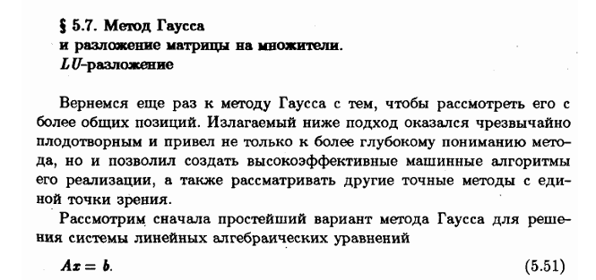

# mathmod - библиотека программ для численного моделирования

## Содержание
- [mathmod - библиотека программ для численного моделирования](#mathmod---библиотека-программ-для-численного-моделирования)
  - [Содержание](#содержание)
  - [Решение нелинейных уравнений](#решение-нелинейных-уравнений)
    - [Постановка задачи](#постановка-задачи)
    - [Основные вопросы](#основные-вопросы)
    - [1. Метод Ньютона](#1-метод-ньютона)
    - [2. Упрощённый метод Ньютона](#2-упрощённый-метод-ньютона)
    - [3. Метод секущих](#3-метод-секущих)
    - [4. Метод ложного положения](#4-метод-ложного-положения)
    - [5. Метод бисекций](#5-метод-бисекций)
    - [6. Метод простой итерации](#6-метод-простой-итерации)
  - [Решение систем линейных алгебраических уравнений (СЛАУ)](#решение-систем-линейных-алгебраических-уравнений-слау)
    - [Постановка задачи](#постановка-задачи-1)
    - [Основные вопросы](#основные-вопросы-1)
    - [Прямые методы](#прямые-методы)
      - [1. Метод Гаусса (схема единственного деления)](#1-метод-гаусса-схема-единственного-деления)
      - [2. Метод Гаусса (схема частичного выбора)](#2-метод-гаусса-схема-частичного-выбора)
      - [3. Метод Холецкого (LLT-разложение)](#3-метод-холецкого-llt-разложение)
      - [4. Метод LU-разложения](#4-метод-lu-разложения)
      - [5. Метод прогонки](#5-метод-прогонки)
    - [Итерационные методы](#итерационные-методы)
      - [1. Метод Якоби](#1-метод-якоби)
      - [2. Метод Гаусса-Зейделя](#2-метод-гаусса-зейделя)
      - [3. Метод релаксации](#3-метод-релаксации)
  - [Установка](#установка)

---

## Решение нелинейных уравнений

### Постановка задачи

Задача отыскания корней нелинейного  уравнения с одним неизвестным вида:

$$
f(x) = 0
$$

**Корень уравнения** - значение $\overline{x}$, при котором $f(\overline{x}) = 0$. Геометрически, $\overline{x}$ является абсциссой точки пересечения графика $f(x)$ с осью $Ox$.

Для заданной точности $\epsilon$ требуется найти приближенное значение корня $\overline{x}^{*}$ такое, что:

$$
|\overline{x} - \overline{x}^{*}| \leq \epsilon
$$

Пусть функция $f(x)$ *дифференцируема* $m > 1$ раз в точке $\overline{x}$, тогда:

**Простой корень** - корень уравнения  $\overline{x}$ называется простым, если $f'(\overline{x}) \neq 0$.

**Кратный корень** - корень уравнения  $\overline{x}$ называется простым, если $f'(\overline{x}) = 0$. Целое  число $m$ назовем кратностью корня $\overline{x}$, если $f^{(k)}(\overline{x}) = 0$, для $k = 1, 2, ..., m - 1$ и $f^{(m)}(\overline{x}) \neq 0$.

**Этапы решения уравнения:**
1. Локализация корня;
2. Вычисление корня с заданной точностью.

**Отрезок локализации** - отрезок $[a, b]$, который содержит 1 корень уравнения.

### Основные вопросы

**Сходящийся итерационный процесс** - метод отыскания корня $\overline{x}$, заключающийся в построении последовательности приближений к нему $x^{(0)}, x^{(1)}, ..., , x^{(k)}, ...$ такой, что:

$$
\lim_{k \to \infty} x^{(k)} = \overline{x}
$$

**Порядок сходимости:**

Пусть в некоторой малой окрестности корня  $\overline{x}$ уравнения $f(x) = 0$ итерационная поледовательность удовлетворяет неравенству:

$$
|\overline{x} - x^{(k)}| \leq C|\overline{x} - x^{(k - 1)}|^{p}
$$

, где $С > 0$ и $p \geq 1$ - постоянные. Тогда $p$ называется *порядком сходимости*.

*Порядок сходимости* - скорость уменьшения погрешности между последовательными приближениями решения. 

**Одношаговый итерационный метод** - метод, у которого очередное приближение $x^{(k + 1)}$ находится только через одно предыдущее $x^{(k)}$. Для его работы нужно знать только одно начальное приближение $x^{(0)}$. (Пример - *метод Ньютона*)

**Многошаговый итерационный метод ($l$ - шаговый)** - метод, у которого очередное  приближение $x^{(k + 1)}$ находится $l$ предыдущих $x^{(k)}, x^{(k - 1)}, ...,  x^{(k - l + 1)}$. Для него следует задать $l$ начальных приближений $x^{(0)}, x^{(1)}, ..., x^{(l - 1)}$. (Пример - *метод секщих*)


**Интервал неопределенности** - окрестность $(\overline{x} - \epsilon, \overline{x} + \epsilon)$ внутри которой любую точку можно принять за приближение к корню.


### 1. Метод Ньютона
- Быстрый итерационный метод для нахождения корня уравнения  $f(x) = 0$.
- Требует предоставления функции $f(x)$ и её производной $f'(x)$.
- **Функция:** `newton(f, df, x, epsilon=1e-6)`
- **Описание параметров:**
  - `f` - Функция, корень которой нужно найти;
  - `df` - Производная функции;
  - `x` - Начальное приближение корня;
  - `epsilon` - Заданная точность (по умолчанию $10^{-6}$). 

```python
from mathmod.nonlinear_equations import newton

x, iteration = newton(f, df, x, epsilon=1e-6)
```

<b>Расчетная формула:</b>
  
$$
x^{(n+1)} = x^{(n)} - \frac{f(x^{(n)})}{f'(x^{(n)})}
$$

<b>Сходимость метода:</b> <i>квадратичная</i> (при выборе начального приближения из достаточно малой окрестности).

<b>Критерий окончания:</b>

$$
|x^{(n+1)} - x^{(n)}| < \varepsilon
$$


### 2. Упрощённый метод Ньютона
- Упрощённая версия метода Ньютона, где производная функции вычисляется только один раз.
- **Функция:** `simplified_newton(f, df, x0, epsilon=1e-6)`<br>
- **Описание параметров:**
  - `f` - Функция, корень которой нужно найти;
  - `df` - Производная функции;
  - `x` - Начальное приближение корня;
  - `epsilon` - Заданная точность (по умолчанию $10^{-6}$). 
  
```python
from mathmod.nonlinear_equations import simplified_newton

x, iteration = simplified_newton(f, df, x0, epsilon=1e-6)
```

<b>Расчетная формула:</b>
  
$$
x^{(n+1)} = x^{(n)} - \frac{f(x^{(n)})}{f'(x^{(0)})}
$$

<b>Сходимость метода:</b> скорость сходимости тем выше, чем ближе начальное приближение $x^{(0)}$ к решению $\overline{x}$.

<b>Критерий окончания:</b>

$$
|x^{(n+1)} - x^{(n)}| < \varepsilon
$$


### 3. Метод секущих
- Не требует аналитической производной функции.
- Использует приближённую производную.
- **Функция:** `secant(f, x_minus_1, x_n, epsilon=1e-6)`
- **Описание параметров:**
  - `f` -  Функция, корень которой нужно найти;
  - `x_minus_1` - Первой начальное приближение;
  - `x` - Второе начальное приближение;
  - `epsilon` - Заданная точность (по умолчанию $10^{-6}$). 

```python
from mathmod.nonlinear_equations import secant

x, iteration = secant(f, x_minus_1, x_n, epsilon=1e-6)
```

<b>Расчетная формула:</b>
  
$$
x^{(n+1)} = x^{(n)} - \frac{x^{(n-1)} - x^{(n)}}{f(x^{(n-1)}) - f(x^{(n)})} f(x^{(n)})
$$

<b>Сходимость метода:</b> $p = \frac{\sqrt{5} + 1}{2} \approx
1.618$ - <i>сверхлинейная</i>, если вычисляется простой корень. При неудачном выборе приближения, метод расходится. Поэтому требуется выбор двух близких к $\overline{x}$ начальных приближений $x^{(0)}$ и $x^{(1)}$.

<b>Критерий окончания:</b>

$$
|x^{(n+1)} - x^{(n)}| < \varepsilon
$$


### 4. Метод ложного положения

- **Функция:** `false_position(f, a, b, epsilon=1e-6)`
- **Описание параметров:**
- `f`: Функция, корень которой нужно найти;
- `a`: Левый конец начального отрезка локализации корня;
- `b`: Правый конец начального отрезка локализации корня;
- `epsilon`: Заданная точность (по умолчанию $10^{-6}$).

```python
from mathmod.nonlinear_equations import false_position

x, iteration = false_position(f, a, b, epsilon=1e-6)
```

<b>Расчетная формула:</b>
  
$$
x^{(n+1)} = x^{(n)} - \frac{c - x^{(n)}}{f(c) - f(x^{(n)})} f(x^{(n)})
$$

, где $c$ - некторая точнка из окрестности корня. 

<b>Сходимость метода:</b> <i>линейная</i>. Для достижения заданной точности требуется тем меньше итераций, чем ближе к корню лежит точка $c$.

<b>Критерий окончания:</b>

$$
|x^{(n+1)} - x^{(n)}| < \varepsilon
$$


### 5. Метод бисекций
- Работает на основе деления отрезка, учитывая значения функции.
- Требует, чтобы начальный отрезок $[a, b]$ удовлетворял условию $f(a) * f(b) < 0$.
**Функция:** `bisection(f, a, b, epsilon)`

**Описание параметров:**
- `f` - Функция, корень которой нужно найти;
- `a` - Левый конец начального отрезка локализации корня;
- `b` - Правый конец начального отрезка локализации корня;
- `epsilon` - Заданная точность (по умолчанию $10^{-6}$).

```python
from mathmod.nonlinear_equations import bisection

x, iteration = bisection(f, a, b, epsilon=1e-6)
```

**Расчетная формула:**

$$
c = \frac{a + b}{2}
$$

**Сходимость метода:** со скоростью геометрической прогрессии, знаменатель которой $q = \frac{1}{2}$.

**Критерий окончания:**

$$
{b^{(n)} - a^{(n)}} < 2\varepsilon
$$

Тогда $x^{(n)} = \frac{ a^{(n)} + b^{(n)} }{2}$ является искомым приближением к корню с точностью $\epsilon$.


### 6. Метод простой итерации
**Функция:** `simple_iteration_method(phi, x0, epsilon=1e-6)`

**Описание параметров:**
- `phi` - Итерационная функция $\phi(x)$, преобразующая исходное уравнение $f(x) = 0$ к виду $x = \phi(x)$;
- `x0` - Начальное приближение корня;
- `epsilon` - Заданная точность (по умолчанию  $10^{-6}$).

```python
from mathmod.nonlinear_equations import simple_iteration_method

x, iteration = simple_iteration_method(phi, x0, epsilon=1e-6)
```

**Расчетная формула:**

$$
x^{(n + 1)} = \phi(x^{(n)})
$$

**Теорема о сходимости:** 

Если в окрестности корня функция $\phi(x)$ непрерывно дифференцируема и удовлетворяет условию:

$$
\max_{x \in [a, b]} |\phi(x)| \leq q 
$$

где $0 \leq q < 1$ - постоянная 

Тогда независимо от выбора начального приближения $x^{(0)}$ из указанной окрестности корня итерационная последовательность не выходит из этой окрестности, метод сходится со скоростью геометрической прогресии и справедлива следующая оценка погрешности (априорная оценка):

**Априорная оценка** - показывет, что итерационный метод сходится

$$
|x^{(n)} - \overline{x}| \leq q^{n}|x^{(0)} - \overline{{x}}|
$$

Чем меньше $q$, тем выше скорость сходимости.

**Апостериорная оценка** - критерий окончания итерационного процесса 

$$
|x^{(n)} - x^{(n-1)}| \leq \frac{1 - q}{q}\epsilon
$$

Если это условие выполнено, то можно считать, что $x^{(n)}$ является приближением к $\overline{x}$ с точностью $\epsilon$.


## Решение систем линейных алгебраических уравнений (СЛАУ)

### Постановка задачи

Система уравнений в общем виде:

$$
\begin{aligned}
    a_{11}x_1 + a_{12}x_2 + a_{13}x_3 + \dots + a_{1m}x_m &= b_1, \\
    a_{21}x_1 + a_{22}x_2 + a_{23}x_3 + \dots + a_{2m}x_m &= b_2, \\
    a_{31}x_1 + a_{32}x_2 + a_{33}x_3 + \dots + a_{3m}x_m &= b_3, \\
    &\dots \\
    a_{m1}x_1 + a_{m2}x_2 + a_{m3}x_3 + \dots + a_{mm}x_m &= b_m.
\end{aligned}
$$


В матричной форме эта система принимает вид:

$$
A \mathbf{x} = \mathbf{b}
$$


, где

$$
A = 
\begin{bmatrix}
    a_{11} & a_{12} & a_{13} & \dots & a_{1m} \\
    a_{21} & a_{22} & a_{23} & \dots & a_{2m} \\
    a_{31} & a_{32} & a_{33} & \dots & a_{3m} \\
    \dots & \dots & \dots & \dots & \dots \\
    a_{m1} & a_{m2} & a_{m3} & \dots & a_{mm}
\end{bmatrix}, \quad
\mathbf{x} =
\begin{bmatrix}
    x_1 \\
    x_2 \\
    x_3 \\
    \vdots \\
    x_m
\end{bmatrix}, \quad
\mathbf{b} =
\begin{bmatrix}
    b_1 \\
    b_2 \\
    b_3 \\
    \vdots \\
    b_m
\end{bmatrix}
$$

$m$ - порядок матрицы;

$A$ - невырожденная матрица ($\Delta A \neq 0$, т.е. $\exists$ единственное решение);

$x$ - вектор неизвестных;

$b$ - вектор свободных членов; 

Пусть $\overline{{x}}$ - точное решение, $x^{\ast}$ - приближенное решение.

$$
\mathbf{\overline{{x}}} =
\begin{bmatrix}
    \overline{{x}}_1 \\
    \overline{{x}}_2 \\
    \overline{{x}}_3 \\
    \vdots \\
    \overline{{x}}_m
\end{bmatrix}  \quad
\mathbf{x^{\ast}} =
\begin{bmatrix}
    x^{\ast}_1 \\
    x^{\ast}_2 \\
    x^{\ast}_3 \\
    \vdots \\
    x^{\ast}_m
\end{bmatrix}
$$

Тогда вектор $\epsilon = \overline{{x}} - x^{*}$ называется вектором погрешности.

<b>Задача:</b> 

Найти решение системы $Ax = b$ с точностью $\epsilon$. Это означает, что нужно найти вектор $x^{\ast}$ такой, что $|| \overline{{x}} - x^{*} || \leq \epsilon$, где $|| \cdot ||$ - одна из норм (единичная, евклидова, бесконечности).


### Основные вопросы

**Прямой метод** - метод, который позволяет получить решение после выполнения конечного числа элементарных операций;

**Итерационный метод** - метод, который строит последовательность приближений к решению;

**Норма** - будем говорить, что в $R^{m}$ введена норма, если каждому вектору $x \in R^{m}$ сопоставлено вещественное число, обозначаемое $||x||$.

1. **Нормы векторов:**

   

   *Свойства норм векторов:*

   

2. **Нормы матриц:**

   

   *Свойства норм матриц:*

   

3. **Абсолютна и относительная погрешность векторов и матриц:**

* Погрешность векторов:

   $\Delta x^{\ast} = ||\overline{x} - x^{\ast}||$ - абсолютная погрешность;

   $\delta x^{\ast} = \frac{\Delta x^{\ast}}{||x^{\ast}||}$ - относительная погрешность;

4. **Вектор невязки** - вектор, показывающий насколько найденное решение СЛАУ отклоняется от точного решения.

$$
r = b - A x^{\ast}
$$

**Число обусловленности** - коэффициент возможного возрастания относительной погрешности решения, вызванное погрешностью задания правой части.

Пусть $\overline{x}$ - точное решение системы $A \overline{x} = b$, а $x^{\ast}$ - решение системы. Тогда верны следующие оценки:

$$
\delta(x^{\ast}) \leq \nu_\delta (\delta(A^{\ast}) + \delta(b^{\ast}))
$$

, где

$$
\nu_\delta = ||A|| * ||A^{-1}|| \quad
\delta(A^{\ast}) = \frac{||A - A^{-1}||}{||A||}|
$$

$\nu(A) = cond(A) = ||A^{-1}|| * ||A||$ - стандартное число обусловленности.

Матрица *плохо* обусловлена, если $cond(A) >> 1$. Следовательно, тогда существует решение, обладающее черезвычайно высокой чувствительностью к малым погрешностям входного данного $b$.

### Прямые методы

**Прямой метод** - метод, который позволяет получить решение после выполнения конечного числа элементарных операций.

#### 1. Метод Гаусса (схема единственного деления)

- **Функция:** `gauss_single_division(A, b)`
  
- `A` - Матрица левой части;
- `b` - Вектор правой части;
  
**Трудоемкость метода** - $\frac{2}{3} m^{3}$

- Прямой ход - матрица $A$ преобразуется к треугольному виду ($m - 1$ - шагов).
- Обратный ход - вычисляются значения неизвестных, начиная с последнего уравнения ($m^{2}$ - шагов).

**Условие применимости** - схема единственного деления не может быть реализована, если один из главных элементов равен нулю. 

**Описание метода:**


```python
from mathmod.linear_systems import gauss_single_division

x = gauss_single_division(A, b)
```

---

**Пример:**

$$
\begin{aligned}
2x_1 + x_2 - x_3 &= 1, \\
4x_1 + 3x_2 - x_3 &= 7, \\
8x_1 + 7x_2 + 3x_3 &= 25.
\end{aligned}
$$

В матричной форме система записывается так:

$$
\left[
\begin{array}{ccc|c}
2 & 1 & -1 & 1 \\
4 & 3 & -1 & 7 \\
8 & 7 & 3 & 25
\end{array}
\right]
$$

**Прямой ход**

Шаг 1: Приведение первого столбца

Делим первую строку на ведущий элемент $a_{11} = 2$:

$$
\left[
\begin{array}{ccc|c}
1 & 0.5 & -0.5 & 0.5 \\
4 & 3 & -1 & 7 \\
8 & 7 & 3 & 25
\end{array}
\right]
$$

Обнуляем элементы ниже ведущего элемента в первом столбце, используя формулу:

$$
a_{ij} \gets a_{ij} - \mu_{ik} \cdot a_{kj}, \quad b_i \gets b_i - \mu_{ik} \cdot b_k,
$$

, где  $\mu_{ik} = \frac{a_{ik}}{a_{kk}}$

Для второй строки:

$$
\mu_{21} = 4, \quad a_{2j} \gets a_{2j} - 4 \cdot a_{1j}
$$

Для третьей строки:

$$
\mu_{31} = 8, \quad a_{3j} \gets a_{3j} - 8 \cdot a_{1j}
$$

Получаем:

$$
\left[
\begin{array}{ccc|c}
1 & 0.5 & -0.5 & 0.5 \\
0 & 1 & 1 & 5 \\
0 & 3 & 7 & 21
\end{array}
\right]
$$

Шаг 2: Приведение второго столбца

Делим вторую строку на ведущий элемент  $a_{22} = 1$ (он уже равен $1$):

$$
\left[
\begin{array}{ccc|c}
1 & 0.5 & -0.5 & 0.5 \\
0 & 1 & 1 & 5 \\
0 & 3 & 7 & 21
\end{array}
\right]
$$

Обнуляем элементы ниже ведущего элемента во втором столбце:

$$
\mu_{32} = 3, \quad a_{3j} \gets a_{3j} - 3 \cdot a_{2j}
$$

Получаем:

$$
\left[
\begin{array}{ccc|c}
1 & 0.5 & -0.5 & 0.5 \\
0 & 1 & 1 & 5 \\
0 & 0 & 4 & 6
\end{array}
\right]
$$

**Обратный ход**

Решаем треугольную систему методом подстановки.

Шаг 1: Найдем $x_3$:

$$
x_3 = \frac{6}{4} = 1.5
$$

Шаг 2: Найдем $x_2$:

$$
x_2 = 5 - 1 \cdot x_3 = 5 - 1 \cdot 1.5 = 3.5
$$

Шаг 3: Найдем $x_1$:

$$
x_1 = 0.5 - 0.5 \cdot x_2 - 0.5 \cdot x_3 = 0.5 - 0.5 \cdot 3.5 + 0.5 \cdot 1.5 = -0.5
$$

**Решение системы:**

$$
x_1 = -0.5, \quad x_2 = 3.5, \quad x_3 = 1.5
$$

---

#### 2. Метод Гаусса (схема частичного выбора)
- **Функция:** `gauss_partial_pivot(a, b)`

**Трудоемкость метода** - $\frac{2}{3} m^{3}$

**Описание метода:**


Отличие от *схемы единственного деления* заключается в том, что на $k$-м шаге исключение в качестве главного элемента выбирают **максимальный** по модулю коэффициент $a_{i_{k}k}$. 

**Вычислительная устойчивость:**

Гарантия ограниченности  роста элементов матрицы делает схему частиного выбора вычислительно устойчивой. Становится справедлива оценка погрешности:

$$
\delta(x^{\ast}) \lesssim f(m) cond_E(A) \epsilon_M
$$

, где:

$x^{\ast}$ - вычисленное ЭВМ решение системы. $\delta(x^{\ast}) = \frac{||x - x^{\ast}||_2}{||x||_2}$ - относительная погрешность;

$cond_E(A) = ||A||_E||A^{-1}||_E$ - числро обусловленности;

$\epsilon_M$ - машинный эпсилон;

$f(m) = C(m)\phi(m)$, где $C(m)$ - некоторая медленно растущая функция, зависящая от порядка стистемы;

$\phi(m)$ - коэффициент роста.

Далее исключение неизвестного $x_{k}$ производят, как в схеме единственного деления. 

```python
from mathmod.linear_systems import gauss_partial_pivot

x = gauss_partial_pivot(A,b)
```

---

**Пример:**

Рассмотрим систему:

$$
A = 
\begin{bmatrix}
2 & -9 & 5 \\
0 & 3.5 & -10 \\
0 & 0.0001 & 3
\end{bmatrix} \quad
b = 
\begin{bmatrix}
-4\\
-6.5\\
3.0001
\end{bmatrix}
$$


---

#### 3. Метод Холецкого (LLT-разложение)
- Для решения СЛАУ с симметрично положительно определённой матрицей.
- **Функция:** `cholecky(A, b)`

**Трудоемкость метода** - $\frac{1}{3}m^{3}$

**Условия применимости** - требуется, чтобы диагональные элементы $l_{ii}$ матрицы $L$ были положительными.

**Достоинства метода:**

- Гарантированная устойчивость;
- Требует вдвое меньше вычислительных затрат по сравнению с методом Гаусса;
- Позволяет экономично использовать память ЭВМ при записи исходных данных и результато вычислений за счет симметричности матрицы A.

**Описание метода:**

$A$ - симетрично положительно определенная матроица ($A = A^{T}$ и $\forall x \neq 0$ скалярное произведение $(Ax, x) > 0$ ). 

$L$ - нижнетреугольная матрица. $L^{T}$ - транспонированная.

$$
A = LL^{T}
$$

, где

$$
LL^{T} = 
\begin{bmatrix}
l_{11} & 0 &  0 & \dots & 0\\
l_{21} & l_{22} & 0 & \dots & 0\\
l_{31} & l_{32} & l_{33} & \dots & 0 \\
\dots & \dots & \dots & \dots & \dots \\
l_{m1} & l_{m2} & l_{m3} & \dots & l_{mm} \\
\end{bmatrix} \cdot
\begin{bmatrix}
l_{11} & l_{21} &  l_{31} & \dots & l_{m1}\\
0 & l_{22} & l_{23} & \dots & l_{m2}\\
0 & 0 & l_{33} & \dots & l_{m3} \\
\dots & \dots & \dots & \dots & \dots \\
0 & 0 & 0 & \dots & l_{mm} \\
\end{bmatrix} =
\begin{bmatrix}
    a_{11} & a_{12} & a_{13} & \dots & a_{1m} \\
    a_{21} & a_{22} & a_{23} & \dots & a_{2m} \\
    a_{31} & a_{32} & a_{33} & \dots & a_{3m} \\
    \dots & \dots & \dots & \dots & \dots \\
    a_{m1} & a_{m2} & a_{m3} & \dots & a_{mm}
\end{bmatrix}
$$

Отсюда: 

$$
l^2_{k1} + l^2_{k2} + \dots + l^2_{kk} = a_{kk} 
$$ 

$$
l_{kk} = \sqrt{a_{kk} - \sum_{j=1}^{k-1} l^{2}_{k,j}} \quad k = 2 \dots m
$$

$$
l_{ik} = \frac{a_{i,k} - \sum_{j-1}^{k-1} l_{i,j} \cdot l_{l,k}}{l_{k,k}} \quad i = k + 1, \dots m
$$

Если разложение получено, то решение системы:

$$
Ly = b \quad 
L^{T}x = y
$$

```python
from mathmod.linear_systems import cholecky

x = cholecky(A, b)
```

---

**Пример:**

Рассмотрим систему:

$$
A = 
\begin{bmatrix}
6.25 & -1 & 0.5 \\
-1 & 5 & 2.12 \\
0.5 & 2.12 & 3.6
\end{bmatrix} \quad
b = 
\begin{bmatrix}
7.5\\
-8.68\\
-0.24
\end{bmatrix}
$$

$l_{11} = \sqrt(a_{11}) = \sqrt{6.25} = 2.5 \quad l_{21} = \frac{a_{21}}{l_{11}}  =\frac{-1}{2.5} = -0.4$

$l_{31} = \frac{a_{31}}{l_{11}} = \frac{0.5}{2.5}   = 0.2 \quad l_{22} = \sqrt{a_{22} - l_{21}^{2}} = \sqrt{5 - 0.16} = 2.2$

$l_{32} = a-{32} - l_{31}l_{21} = (2.12 - \frac{0.2 \cdot (-0.4)}{2.2}) = 1$

$l_{33} = \sqrt{a_{22} - l_{31}^{2} - l_{32}^{2}} = \sqrt{3.6 - 0.2^{2} - 1^{2}} = 1.6$

Матрица $L$:

$$
L = 
\begin{bmatrix}
2.25 & 0 & 0 \\
-0.4 & 2.2 & 0 \\
0.2 & 1 & 1.6
\end{bmatrix}
$$

Решение состоит из 2-х шагов:

1. Решаем $Ly = b$ для $y$ методом прямой подстановки.
2. Решаем $L^{T}x = y$ для $x$ методом обратной подстановки.

Решение:

1. Прямой ход для $y$:
   
$$
Ly = b
$$

$$
\begin{bmatrix}
2.5 & 0 & 0 \\
-0.4 & 2.2 & 0 \\
0.2 & 1 & 1.6
\end{bmatrix} \cdot 
\begin{bmatrix}
y_1\\
y_2\\
y_3
\end{bmatrix} =
\begin{bmatrix}
7.5\\
-8.68\\
-0.24
\end{bmatrix}
$$

- Рассчитываем $y$:

$$
\begin{aligned}
2.5 \cdot y_1 &= 7.5, \\
-0.4 \cdot y_1 + 2.2 \cdot y_2 &= -8.68, \\
0.2 \cdot y_1 + y_2 + 1.6 \cdot y_3 &= -0.24 \\
\end{aligned}
$$

- Решая, получаем:

$$
y_1 = 3, \\
y_2 = -3.4, \\
y_3 = 1.6 \\
$$

2. Обратный ход для $x$:
   
$$
L^{T}x = y
$$

$$
\begin{bmatrix}
2.5 & -0.4 & 0.2 \\
0 & 2.2 & 1 \\
0 & 0 & 1.6
\end{bmatrix} \cdot 
\begin{bmatrix}
x_1\\
x_2\\
x_3
\end{bmatrix} =
\begin{bmatrix}
3\\
-3.4\\
1.6
\end{bmatrix}
$$

- Рассчитывем $x$:

$$
\begin{aligned}
2.5 \cdot x_1 -0.4 \cdot x_2 + 0.2 \cdot x_3 &= 3, \\
2.2 \cdot x_2 + x_3 &= -3.4, \\
1.6 \cdot x_3 &= 1.6.
\end{aligned}
$$

- Решая, получаем:

$$
x_1 = 0.8, \quad
x_2 = -2, \quad
x_3 = 1 \quad
$$


---

#### 4. Метод LU-разложения
- **Функция:** `lu(A, b)`

**Трудоемкость метода** - $\frac{2}{3} m^{3} + m^{2}$

**Теорема о возможности применения $LU$ - разложения** - если все главные миноры матрицы $A$ отличны от нуля, то существуют единственная нижняя треугольная матрица $L$ и верхняя треугольная матрица $U$ такие, что:

$$
A = LU
$$

, где

$$
L = 
\begin{bmatrix}
1 & 0 &  0 & \dots & 0\\
\mu_{21} & 1 & 0 & \dots & 0\\
\mu_{31} & \mu_{32} & 1 & \dots & 0 \\
\dots & \dots & \dots & \dots & \dots \\
\mu_{m1} & \mu_{m2} & \mu_{m3} & \dots & 1 \\
\end{bmatrix}
$$

**Описание метода:**
 



```python
from mathmod.linear_systems import lu_solve

x = lu_solve(A, b)
```

---

**Пример:**

Рассмотрим систмему:

$$
A = 
\begin{bmatrix}
2 & -1 & -2 \\
-4 & 6 & 3 \\
-4 & -2 & 8
\end{bmatrix} \quad
b = 
\begin{bmatrix}
-5\\
6\\
8
\end{bmatrix}
$$

Мы хотим представить её в виде произведения:

$$
A = LU
$$

, где:

$$
L = 
\begin{bmatrix}
1 & 0 & 0 \\
\mu_{21} & 1 & 0 \\
\mu_{31} & \mu_{32} & 1
\end{bmatrix}, \quad
U = 
\begin{bmatrix}
u_{11} & u_{12} & u_{13} \\
0 & u_{22} & u_{23} \\
0 & 0 & u_{33}
\end{bmatrix}.
$$

**Шаг 1: Прямой ход (разложение)**

1. Выбираем первый элемент матрицы $A$ как ведущий: 
   
$$
u_{11} = 2
$$

   Элементы верхней матрицы $U$:

$$
u_{12} = -1, \quad u_{13} = -2.
$$

2. Вычисляем коэффициенты для матрицы $L$:
   
$$
\mu_{21} = \frac{a_{21}}{u_{11}} = \frac{-4}{2} = -2, \quad
\mu_{31} = \frac{a_{31}}{u_{11}} = \frac{-4}{2} = -2.
$$

3. Обновляем элементы второй строки:
   
$$
u_{22} = a_{22} - \mu_{21} \cdot u_{12} = 6 - (-2) \cdot (-1) = 4,
$$

$$
u_{23} = a_{23} - \mu_{21} \cdot u_{13} = 3 - (-2) \cdot (-2) = -1.
$$

4. Обновляем элементы третьей строки:

$$
u_{32} = a_{32} - \mu_{21} \cdot u_{12} = -2 - (-2) \cdot (-1) = -4
$$

$$
u_{33} = a_{33} - \mu_{21} \cdot u_{13} = 8 - (-2) \cdot (-2) = 4
$$

5. Промежуточные результаты:

$$
L = 
\begin{bmatrix}
1 & 0 & 0 \\
-2 & 1 & 0 \\
-2 & \mu_{32} & 1
\end{bmatrix}, \quad
U = 
\begin{bmatrix}
2 & -1 & -2 \\
0 & 4 & -1 \\
0 & -4 & 4
\end{bmatrix},
$$

6. Вычисляем $\mu_{32}$:
   
$$
\mu_{32} = \frac{u_{32}}{u_{22}} = -1
$$

7. Обновляем элементы третьей строки:

$$
u_{33} = u_{33} - \mu_{32} \cdot u_{23} = 4 - (-1) \cdot (-1) = 3
$$

8. Итоговые матрицы

$$
L = 
\begin{bmatrix}
1 & 0 & 0 \\
-2 & 1 & 0 \\
-2 & -1 & 1
\end{bmatrix}, \quad
U = 
\begin{bmatrix}
2 & -1 & -2 \\
0 & 4 & -1 \\
0 & 0 & 3
\end{bmatrix}.
$$

**Шаг 2: решение системы**

Для решения системы $Ax = b$, где:

$$
A = LU,
$$

Решение состоит из 2-х шагов:

1. Решаем $Ly = b$ для $y$ методом прямой подстановки.
2. Решаем $Ux = y$ для $x$ методом обратной подстановки.

Решение:

1. Прямой ход для $y$:
   
$$
Ly = b
$$

$$
\begin{bmatrix}
1 & 0 & 0 \\
-2 & 1 & 0 \\
-2 & -1 & 1
\end{bmatrix} \cdot 
\begin{bmatrix}
y_1\\
y_2\\
y_3
\end{bmatrix} =
\begin{bmatrix}
-5\\
6\\
8
\end{bmatrix}
$$

- Рассчитывем $y$:

$$
\begin{aligned}
y_1 &= -5, \\
-2 \cdot y_1 + y_2 &= 6, \\
-2 \cdot y_1 - 1 \cdot y_2 + y_3 &= 8.
\end{aligned}
$$

- Решая, получаем:

$$
y_1 = -5, \\
y_2 = -4, \\
y_3 = -6 \\
$$

2. Обратный ход для $x$:
   
$$
Ux = y
$$

$$
\begin{bmatrix}
2 & -1 & -2 \\
0 & 4 & -1 \\
0 & 0 & 3
\end{bmatrix} \cdot 
\begin{bmatrix}
x_1\\
x_2\\
x_3
\end{bmatrix} =
\begin{bmatrix}
-5\\
-4\\
-6
\end{bmatrix}
$$

- Рассчитывем $x$:

$$
\begin{aligned}
2 \cdot x_1 - x_2 - 2 \cdot x_3 &= -5, \\
4 \cdot x_2 - x_3 &= -4, \\
3 \cdot x_3 &= -6.
\end{aligned}
$$

- Решая, получаем:

$$
x_1 = -5.25, \quad
x_2 = -1.5, \quad
x_3 = -2
$$

---

#### 5. Метод прогонки
- **Функция:** `three_diag(A,b)`

**Трудоемкость метода** - $8m$

**Условие применимости** - коэффициенты системы удовлетворяют условиям диагонального преобладания:

$$
|b_k| \geq |a_k| + |c_k| \quad
|b_k| > |a_k|
$$

Тогда:

$$
\gamma_i = b_i + a_i \alpha_{i-1} \neq 0 \quad
|\alpha_i| \leq 1 \quad \forall i = 1, 2, \dots m
$$

**Описание метода:**

$A$ - терхдиагональная матрица:

$$
A = 
\begin{bmatrix}
b_1 & c_1 &  0 & \dots & \dots & 0\\
a_2 & b_2 & c_2 & \dots & \dots & 0\\
0 & a_3 & b_3 & c_3 & \dots & 0 \\
\dots & \dots & \dots & \dots & \dots & \dots \\
\dots & \dots & \dots & a_{m-1} & b_{m-1} & c_{m-1} \\
0 & 0 & 0 & \dots & a_m & b_m \\
\end{bmatrix} \quad 
b = 
\begin{bmatrix}
d_1\\
d_2\\
d_3\\
\vdots \\
b_{m-1} \\
b_m
\end{bmatrix}
$$

- **Прямой ход (прямая прогонка)** - вычисление прогоночных коэффициентов  
 
$$
\alpha_i = -\frac{c_i}{\gamma_i} \quad
\beta_i = \frac{d_i - \alpha_i \beta_{i - 1}}{\gamma_i} \quad
\gamma_i = b_i + a_i \alpha_{i - 1}
$$

- **Обратная прогонка (обратная прогонка)** - вычисление значения незвестных. Сначала $x_m = \beta_m$. Затем значения осталных неизветных по формуле:

$$
x_i = \alpha_i x_{i + 1} + \beta_i \quad
i = m - 1, m - 2, \dots, 1
$$ 

```python
from mathmod.linear_systems import three_diag

x = three_diag(A,b)
```

---

**Пример:**

Рассмотрим систмему:

$$
A = 
\begin{bmatrix}
5 & -1 & 0 & 0 \\
2 & 4.6 & -1 & 0 \\
0 & 2 & 3.6 & -0.8 \\
0 & 0 & 3 & 4.4
\end{bmatrix} \quad
b = 
\begin{bmatrix}
2\\
3.3\\
2.6\\
7.2
\end{bmatrix}
$$

**Прямой ход**

$$
\gamma_1 = b_1 = 5, \quad \alpha_1 = -c_1 / \gamma_1 = 0.2, \quad \beta_1 = d_1 / \gamma_1 = 2.0 / 5 = 0.4,
$$

$$
\gamma_2 = b_2 + a_2 \alpha_1 = 4.6 + 2.0 \cdot 0.2 = 5, \quad \alpha_2 = -c_2 / \gamma_2 = 1 / 5 = 0.2,
$$

$$
\beta_2 = (d_2 - a_2 \beta_1) / \gamma_2 = (3.3 - 2.0 \cdot 0.4) / 5 = 0.5,
$$

$$
\gamma_3 = b_3 + a_3 \alpha_2 = 3.6 + 2.0 \cdot 0.2 = 4, \quad \alpha_3 = -c_3 / \gamma_3 = 0.8 / 4 = 0.2,
$$

$$
\beta_3 = (d_3 - a_3 \beta_2) / \gamma_3 = (2.6 - 2.0 \cdot 0.5) / 4 = 0.4,
$$

$$
\gamma_4 = b_4 + a_4 \alpha_3 = 4.4 + 3.0 \cdot 0.2 = 5, \quad \beta_4 = (d_4 - a_4 \beta_3) / \gamma_4 = (7.2 - 3.0 \cdot 0.4) / 5 = 1.2.
$$

**Обратный ход**

$$
x_4 = \beta_4 = 1.2,
$$

$$
x_3 = \alpha_3 z_4 + \beta_3 = 0.2 \cdot 1.2 + 0.4 = 0.64,
$$

$$
x_2 = \alpha_2 z_3 + \beta_2 = 0.2 \cdot 0.64 + 0.5 = 0.628,
$$

$$
x_1 = \alpha_1 z_2 + \beta_1 = 0.2 \cdot 0.628 + 0.4 = 0.5256.
$$

Итак, получаем решение:

$$
x_1 = 0.5256, \quad x_2 = 0.628, \quad x_3 = 0.64, \quad x_4 = 1.2.
$$

---

### Итерационные методы 

**Итерационный метод** - метод, который строит последовательность приближений к решению;

#### 1. Метод Якоби
- **Функция:** `jacobi(A, b, epsilon=1e-6, norma=1)`

**Теорема о сходимости:**

Пусть выполнено условие:

$$
||B|| < 1
$$

Тогда решение системы $\overline{x}$ существует и единственно при произволном приближении $x^{(0)}$ МПИ сходится и справедлива оценка погрешности (*априорная оценка*):

$$
||x^{(n)} - \overline{x}|| \leq ||B||^{n}||x^{(0)} - \overline{x}||
$$

**Апостериорная оценка:**

$$
||x^{(n)} - \overline{x}|| \leq \frac{||B||}{1 - ||B||} ||x^{(n)}- x^{(n - 1)}||
$$

**Критерий окончания:**

$$
||x^{(n)}- x^{(n - 1)}|| \leq \epsilon_1
$$

, где:

$$
 \epsilon_1  = \frac{||B||}{1 - ||B||} \epsilon
$$

Более простой критерий окончания:

$$
||x^{(n)}- x^{(n - 1)}|| \leq \epsilon
$$

**Описание метода:**


$$
\begin{aligned}
    x_1^{k+1} = b_{11}x_1^{k} + b_{12}x_2^{k} + b_{13}x_3^{k} + \dots + b_{1m}x_m^{k} + c_{1}, \\
    x_2^{k+1} = b_{21}x_1^{k} + b_{22}x_2^{k} + b_{23}x_3^{k} + \dots + b_{2m}x_m^{k} + c_{2}, \\
    x_3^{k+1} = b_{31}x_1^{k} + b_{32}x_2^{k} + b_{33}x_3^{k} + \dots + b_{3m}x_m^{k} + c_{3}, \\
    \dots \\
    x_m^{k+1} = b_{m1}x_1^{k} + b_{m2}x_2^{k} + b_{m3}x_3^{k} + \dots + b_{mm}x_m^{k} + c_{m}, \\
\end{aligned}
$$

```python
from mathmod.linear_systems import jacobi

x, iteration_count = jacobi(A, b, epsilon=1e-6, norma=1)
```

---

**Пример:**


---

#### 2. Метод Гаусса-Зейделя
- Итерационный метод для решения СЛАУ с диагонально преобладающей матрицей.
- **Функция:** `gauss_zeydel(A, b, epsilon=1e-6, norma=1)`
- **Оценка погрешности:**

$$
\| x^{(k+1)} - x^{(k)} \|_1 \leq \varepsilon
$$

где:
         <br><br>$x^{(k + 1)}$ — приближённое решение на следующей итерации;<br>
         <br>$x^{(k)}$ — приближённое решение на $k$-й итерации;<br>
         <br>$|| \cdot ||_p$ — норма вектора, например, $p = 1$ или $\infty$ (по умолчанию единичная норма);<br>
         <br>$\varepsilon$ — заданная точность (по умолчанию $10^{-6}$).<br>


#### 3. Метод релаксации

```python
from mathmod.linear_systems import relaxation_method

x, iteration_count = relaxation_method(A,b, omega=1, norma=1)
```

---


---

## Установка
Для использования библиотеки склонируйте репозиторий и установите необходимые зависимости:
```bash
git clone https://github.com/BaranovSerV/mathmod.git
cd mathmod
pip install -r requirements.txt
